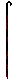
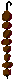

# chekanov
> sorry for my English

# Content
1. [Introduction](#intro)
2. [Gameplay](#gameplay)

## 1. Introduction

This is my first game written in pygame ( python ).

It's dedicated to a wonderful teacher and person, Dmitry Alexandrovich Chekanov. That's why the game is called chekanov.

  

## 2. Gameplay

The main task of the game is to collect skewers with meat and dodge empty skewers. If you collect an empty skewer, you will lose. :pensive: :dizzy_face:

Maximum amount of meat on a skewer : 8.

| Empty skewer                    | Skewer with 8 pieces of meat                     |
| ------------------------------- | ------------------------------------------------ |
|  |  |